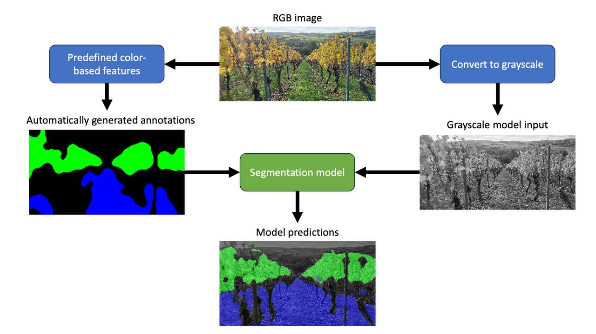

# VinePilot: Semantic Segmentation for Autonomous Driving in Vineyards

## Approach

## Project Structure
- **Config:** Contains configurations and paths for the project.
- **Data:** Includes the source vineyard video (not uploaded) and predictions.
- **Model:** Encompasses model training and inference, loss calculation, and optimizer settings.
- **Tools:** AutoSeg, a tool designed for automatic annotation.
- **Utils:** Houses useful functions for image manipulation.

